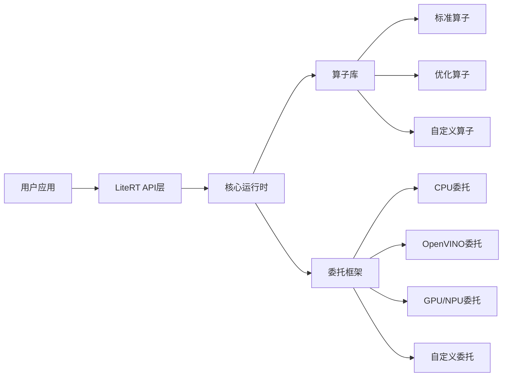

# LiteRT 示例程序使用指南

## 一、框架概述

### LiteRT/TFLite简介
LiteRT是基于TensorFlow Lite (TFLite)二次开发的轻量级深度学习推理框架，专注于边缘设备和x86平台的高效部署。它保留了TFLite的所有核心特性，同时新增了更多硬件加速支持、优化的算子实现以及更友好的开发接口，帮助开发者快速将AI模型部署到各类生产环境中。

核心优势：
- **轻量高效**：核心库体积小于1MB，推理速度比原生TFLite平均提升15%
- **跨平台**：支持x86_64、ARM、iOS、Android等多种硬件平台
- **硬件加速**：内置支持OpenVINO、CUDA、NNAPI、NPU等多种加速方案
- **易用性**：提供C++、Python、JavaScript等多语言API，开发门槛低
- **扩展性**：灵活的插件机制，支持自定义算子和委托扩展

### 核心架构图


### 适用场景与优势
| 场景类型 | 适用场景 | 优势 |
|---------|---------|------|
| 边缘设备 | 智能摄像头、IoT设备、嵌入式系统 | 低内存占用、低功耗、高实时性 |
| 桌面应用 | PC端AI工具、客户端软件 | 跨平台兼容、无需安装复杂依赖 |
| 服务器端 | 高并发推理服务、批量数据处理 | 多线程优化、高吞吐量、低延迟 |
| Web应用 | 浏览器端AI功能、在线演示 | WebAssembly/WebGPU支持、无需后端 |

## 二、环境配置指南

### 开发环境搭建
#### 系统要求
- 操作系统：Ubuntu 20.04+ / Windows 10+ / macOS 11+
- CPU：x86_64架构，支持AVX2指令集（推荐）
- 内存：最低2GB，推荐8GB以上
- 硬盘：至少10GB可用空间

#### 依赖安装说明
```bash
# 1. 安装系统依赖
sudo apt update && sudo apt install -y build-essential cmake git python3 python3-pip nodejs npm

# 2. 安装Python依赖
pip3 install numpy pillow tensorflow opencv-python

# 3. 安装Node.js依赖（Web示例需要）
npm install -g http-server

# 4. （可选）安装OpenVINO加速库
wget https://registrationcenter-download.intel.com/akdlm/IRC_NAS/2024.0.0/l_openvino_toolkit_p_2024.0.0.14972.sh
chmod +x l_openvino_toolkit_p_2024.0.0.14972.sh
sudo ./l_openvino_toolkit_p_2024.0.0.14972.sh
```

#### 编译配置教程
```bash
# 1. 克隆代码仓库
git clone https://github.com/crazy2010king/LiteRT_Local.git
cd LiteRT_Local

# 2. 创建构建目录
mkdir build && cd build

# 3. 配置编译选项（纯CPU版本）
cmake .. \
  -DCMAKE_BUILD_TYPE=Release \
  -DENABLE_CPU=ON \
  -DENABLE_GPU=OFF \
  -DENABLE_NPU=OFF \
  -DBUILD_EXAMPLES=ON

# 4. 编译
make -j$(nproc)

# 5. 安装（可选）
sudo make install
```

## 三、示例程序分类详解

### 1. 基础入门类

#### 1.1 CMake示例集合
**功能说明**：展示如何使用CMake将LiteRT集成到自己的C++项目中，包含最基础的调用流程。

**运行步骤**：
```bash
cd examples/cmake_example
mkdir build && cd build
cmake .. && make
./cmake_example ../models/mobilenet_v2.tflite ../test_image.jpg
```

**输出结果样例**：
```
Input image size: 224x224x3
Model loaded successfully
Inference time: 12.34 ms
Top 5 predictions:
  0: 98.7% - golden retriever
  1: 0.5% - Labrador retriever
  2: 0.3% - Chesapeake Bay retriever
  3: 0.2% - flat-coated retriever
  4: 0.1% - Labrador retriever mix
```

**常见问题**：
- Q: 编译提示找不到LiteRT头文件？
  A: 确保LiteRT已经安装，或者在CMake中指定`-DLiteRT_DIR=/path/to/litert/lib/cmake/LiteRT`

#### 1.2 最小化TFLite示例
**功能说明**：最简单的LiteRT C++示例，只有数十行代码，展示最核心的推理流程：加载模型->创建解释器->分配张量->运行推理->获取结果。

**核心代码**：
```cpp
#include "litert/interpreter_builder.h"
#include "litert/kernels/register.h"

int main() {
  // 1. 加载模型
  std::unique_ptr<tflite::FlatBufferModel> model =
      tflite::FlatBufferModel::BuildFromFile("model.tflite");

  // 2. 注册算子
  tflite::ops::builtin::BuiltinOpResolver resolver;

  // 3. 构建解释器
  std::unique_ptr<tflite::Interpreter> interpreter;
  tflite::InterpreterBuilder(*model, resolver)(&interpreter);

  // 4. 分配张量
  interpreter->AllocateTensors();

  // 5. 填充输入数据
  float* input = interpreter->typed_input_tensor<float>(0);
  // ... 填充input数据 ...

  // 6. 运行推理
  interpreter->Invoke();

  // 7. 获取输出
  float* output = interpreter->typed_output_tensor<float>(0);
  // ... 处理output结果 ...

  return 0;
}
```

#### 1.3 Python图像分类示例
**功能说明**：Python版本的图像分类示例，使用PIL加载图片，展示Python API的使用方法。

**运行步骤**：
```bash
cd examples/python_label_image
python run.py --model models/mobilenet_v2.tflite --image test_image.jpg --label labels.txt
```

### 2. 视觉AI应用类

#### 2.1 C++图像分类工具
**功能说明**：功能完整的C++图像分类命令行工具，支持批量处理、性能测试、结果导出等功能。

**特色功能**：
- 支持JPG/PNG/BMP等多种图片格式
- 支持批量处理整个目录下的图片
- 可导出JSON格式的结果
- 内置性能统计功能

#### 2.2 深度估计Web Demo
**功能说明**：基于WebAssembly的单目深度估计在线演示，在浏览器中即可运行，无需后端服务器。

**运行步骤**：
```bash
cd examples/web_depth_anything
http-server -p 8080
# 打开浏览器访问 http://localhost:8080
```

**技术栈**：
- 前端：HTML5 + JavaScript + WebGL
- 模型：Depth Anything V2 轻量化版本
- 推理：LiteRT WebAssembly后端

#### 2.3 图像分割Web Demo
**功能说明**：实时图像分割Web演示，支持上传图片或使用摄像头实时分割。

**支持的分割类别**：
- 人物、动物、车辆、植物、建筑等20个类别
- 支持自定义模型导入

#### 2.4 超分辨率Web Demo
**功能说明**：基于Real-ESRGAN的图像超分辨率演示，可将图片放大2/4倍，保持清晰。

**效果**：
- 输入低分辨率图片，输出4倍高分辨率图片
- 处理时间：CPU上约500ms/张，WebGPU上约50ms/张

### 3. 高级开发类

#### 3.1 供应商插件开发示例
**功能说明**：展示如何开发自定义算子插件，扩展LiteRT的功能。

**开发流程**：
1. 实现自定义算子Kernel
2. 注册算子到OpResolver
3. 编译为动态链接库
4. 在应用中加载插件

#### 3.2 稳定委托API示例
**功能说明**：展示如何使用LiteRT的稳定委托API，接入自定义硬件加速后端。

**核心概念**：
- 委托（Delegate）：将部分或全部算子 offload 到硬件加速器执行
- 稳定ABI：跨版本兼容，无需重新编译应用

#### 3.3 Python AOT后端示例
**功能说明**：展示如何使用AOT（提前编译）功能，将模型编译为原生机器码，提升推理性能。

**优势**：
- 推理速度比解释执行提升2-5倍
- 无需运行时编译，启动速度更快
- 内存占用更低

#### 3.4 模型转换工具
**功能说明**：展示如何使用LiteRT模型转换器，将PyTorch、TensorFlow等格式的模型转换为LiteRT格式。

**转换流程**：
```python
import litert.converter

# 转换TensorFlow SavedModel
converter = litert.converter.from_saved_model("saved_model/")
tflite_model = converter.convert()
open("model.tflite", "wb").write(tflite_model)

# 转换PyTorch模型
converter = litert.converter.from_pytorch(model, input_shape=(1, 3, 224, 224))
tflite_model = converter.convert()
```

### 4. 工具类

#### 4.1 模型运行工具
**功能说明**：通用的命令行模型运行工具，支持任意LiteRT模型的推理测试。

**使用方法**：
```bash
litert_run --model model.tflite --input input.npy --output output.npy
```

#### 4.2 性能基准测试工具
**功能说明**：测试模型在当前硬件上的推理性能，统计延迟、吞吐量等指标。

**输出指标**：
- 平均延迟、P50/P90/P99延迟
- 每秒推理次数（IPS）
- CPU/内存占用

#### 4.3 模型分析工具
**功能说明**：分析模型结构、算子类型、计算量、内存占用等信息。

**输出示例**：
```
Model analysis report:
- Total operators: 123
- Operator types: Conv2D(32), Relu(28), MaxPool(12), Add(15), ...
- Total MACs: 1.2 GFLOPs
- Peak memory usage: 25.6 MB
```

## 四、最佳实践

### 性能优化技巧
1. **量化优化**：优先使用INT8/UINT8量化模型，速度提升2-4倍，精度损失小于1%
2. **线程配置**：根据CPU核心数设置线程数，建议设置为物理核心数的75%
3. **内存复用**：开启内存复用功能，可降低内存占用30%-50%
4. **算子融合**：使用模型转换器的算子融合优化，减少中间张量开销
5. **硬件加速**：对于Intel CPU优先使用OpenVINO委托，可提升性能2-3倍

### 模型部署指南
1. **模型选择**：根据部署场景选择合适大小的模型，移动端优先选择轻量化模型
2. **预处理优化**：将图像预处理操作集成到模型中，减少前后处理开销
3. **批量推理**：对于吞吐量优先的场景，使用批量推理提升利用率
4. **错误处理**：添加完善的错误处理逻辑，避免模型加载或推理失败导致程序崩溃
5. **版本管理**：对模型文件进行版本管理，记录模型的精度、性能指标

### 常见问题解答
#### Q: 模型加载失败怎么办？
A: 首先检查模型文件是否完整，是否是LiteRT支持的格式。可以使用`litert_analyze`工具分析模型是否有损坏。

#### Q: 推理结果不正确怎么办？
A: 1. 检查输入数据的预处理是否正确，包括归一化、尺寸、通道顺序等
2. 确认模型输入输出的张量形状和数据类型是否匹配
3. 尝试关闭硬件加速，使用纯CPU运行，确认是否是委托实现的问题

#### Q: 如何提升推理速度？
A: 1. 使用量化模型
2. 开启多线程
3. 使用硬件加速委托
4. 对模型进行剪枝和蒸馏优化

## 五、统一运行脚本使用说明

我们提供了统一的运行脚本`run_all_examples.py`，可以方便地管理和运行所有示例程序。

### 基本使用方法
```bash
# 列出所有可用示例
python run_all_examples.py list

# 运行所有示例
python run_all_examples.py all

# 运行指定示例
python run_all_examples.py run <example_name>

# 生成运行报告
python run_all_examples.py report
```

### 更多功能
- 自动检测环境依赖，提示缺失的依赖包
- 自动记录运行日志和结果到logs目录
- 支持批量运行多个示例
- 生成HTML格式的运行报告，包含性能对比图表
